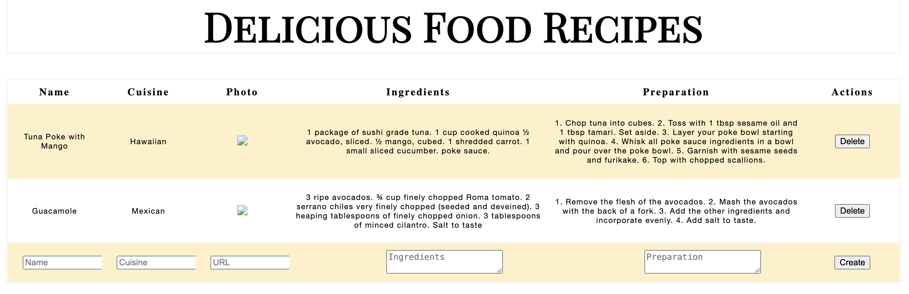

# Library Project

This project is built to help organize recipe data digitally. You can enter recipe data in the field near the bottom and select `create` to save the recipe. If you choose to, you can also delete the recipe using the `delete` buttons on the right side.

## Screenshot

## Technology

### Built with:

- Javascript
- React
- HTML

## Installation

Follow these steps to set up your project locally:

1.  **Clone the repository**

        git clone https://github.com/tpoole1441/recipe-tracking-app.git

2.  **Navigate to the project directory**

        cd recipe-tracking-app

3.  **Install dependencies**

        npm install

4.  **Start the development server**

        npm start
